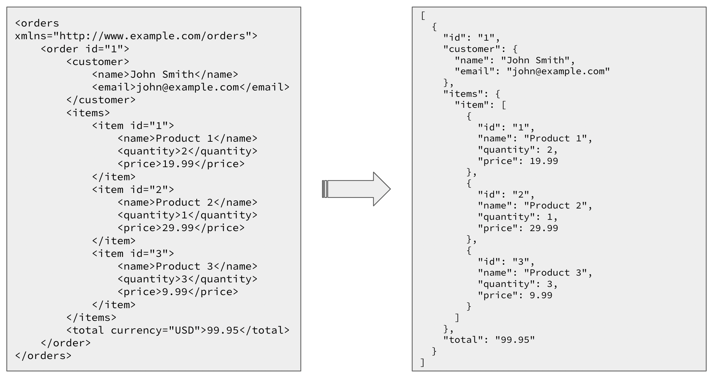
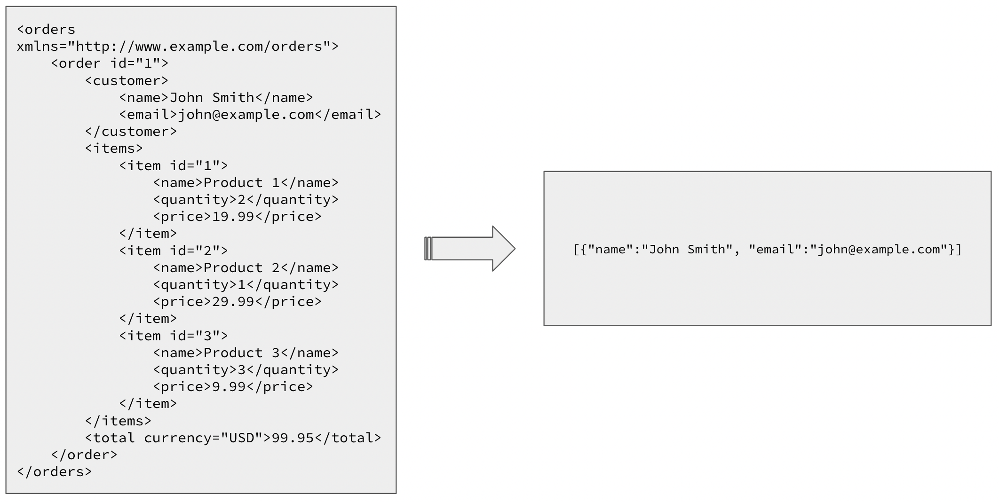
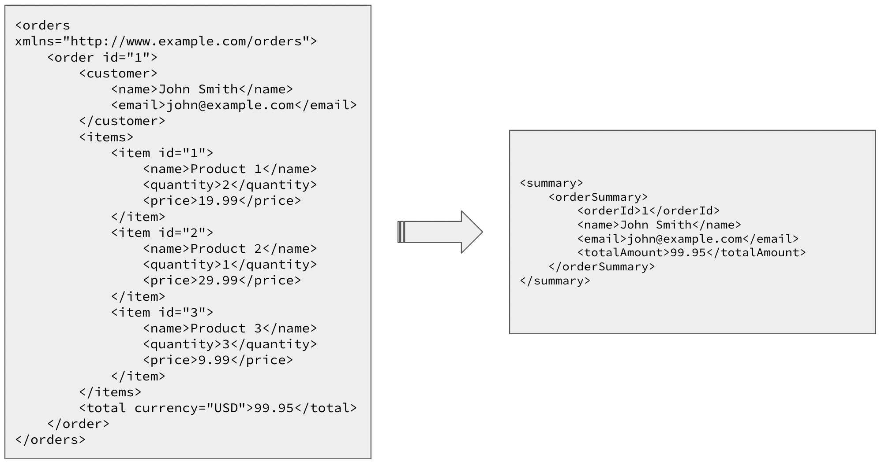
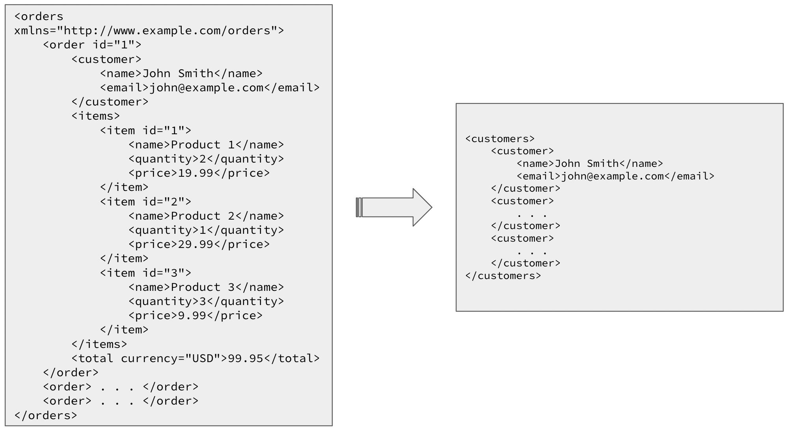
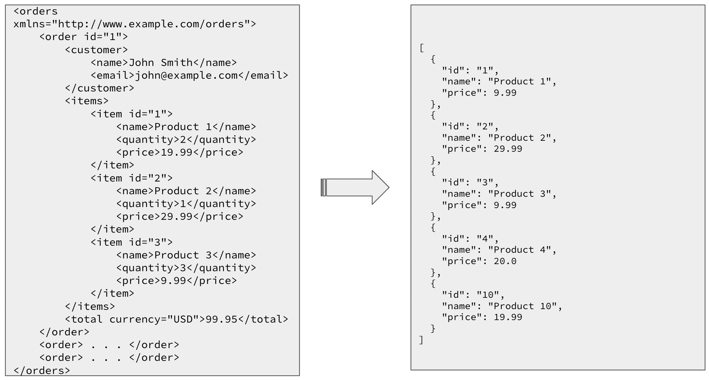

# [Ballerina] Customer Order Details Service Demo

This project showcases XML manipulations using Ballerina and transforming the XML to JSON output, tables, arrays, maps using query expressions. Also it demonstrates the usage of the langlib function to convert the text data of the xml payload to Ballerina built-in types.

This project will demonstrate the following:

* Converting XML to JSON directly using `xmldata` standard library
* Accessing XML attributes and elements using XML navigation expressions similar to xPath
* Converting XML to JSON using query expressions
* Transforming a given XML to a different XML format
* Using query expressions to convert XML to tables, arrays, maps to generate an array of JSON objects, remove duplicates, etc.

# Scenario

This part of the session shows how to consume a XML payload and perform various kinds of operations on that payload. Let’s assume that the payload is from an API exposed by a retail shop and this XML payload contains the information about the customers, their orders and the items included in those orders. Same customers may come several times within the day.

## Prerequisites

* Ballerina 2201.4.0 or later
* `curl` or any tool to invoke an HTTP endpoint.

# Setup the scenario

1. Clone the dummy [order-service](https://github.com/gimantha/dummy-order-service.git) repository and navigate to the `order-service` directory and run the following command to start the service.

    ```bash
    $ bal run
    ```
2. Clone the [customer-order-details-service](https://github.com/gimantha/customer-order-details.git) repository and navigate to the `customer-order-details-service` directory and run the following command to start the service.

    ```bash
    $ bal run
    ```
3. Invoke the service using the following command.

    ```bash
    $ curl http://localhost:8000/{endpoint}
    ```

    where `{endpoint}` is one of the following endpoints.

    ```bash
    /orders
    /customers
    /unique-customers
    /unique-items
    /order-summary
    ```
## Transforming the XML payload to a JSON output.

`xmldata` standard library is used to convert the XML payload into a record. Then the record is returned as a JSON without any alteration. 




## Extracting all the customers from the XML payload and returning them as a JSON array.

XML navigation expressions are used to extract data from inner elements of the payload using `data()` function and XML attribute access expression.



## Transforming the order details into a summary of the orders within the day

XML navigation expressions, query expressions and xml templates are used to create a different XML output from the input XML payload.



## Extracting Unique customers from the XML Payload eliminating the potential duplicates.

In this scenario, the same customer can come multiple times within the day to purchase goods. To get the Unique customers from the input XML, query expression and tables are used by keeping the customer email as the hash key. This also demonstrates how to convert an array to a table using query expression.



## Extract unique items purchased by all the customers within the day.

This use-case shows how to remove duplicates using a query expression which generates a map keeping the `id` as the key. We will be directly using a query expression to iterate through the XML and generate a map while de-duplicating the items and convert that map to an array of items using `toArray` langlib function and return it as a JSON response. This example also illustrates how to use the langlib function `fromString` to convert string values extracted from the XML to integers or floating point numbers.

